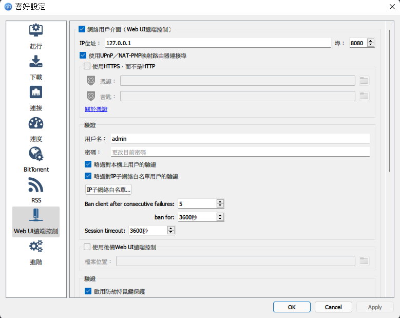

# AnimeFinder

ACG資源搜尋、下載工具。
[English version of ReadMe](README_EN.md)

## Build Status

## 系統需求

- Windows / macOS / android / (linux及iOS可自行編譯)
- *(編譯用)* [Flutter SDK](https://docs.flutter.dev/get-started/install), *(Android)* [Android Studio](https://developer.android.com/studio/install), *(iOS, macOS)*  [Xcode](https://apps.apple.com/us/app/xcode/id497799835?mt=12), *(Windows)* [Visual Studio](https://visualstudio.microsoft.com/downloads/)
- 下載功能需要[qBittorrent v4.1+](https://www.qbittorrent.org/download.php)

## 重點功能

- 支援中文及英文介面
- 支持橫向和直向介面 (預設自動切換，可改為固定介面)
- 支援以下站點瀏覽及搜尋:
  - [動漫花園](https://share.dmhy.org) (動漫、動漫音樂、遊戲、漫畫、日劇)
  - [ACG.RIP](https://acg.rip) (動漫、日劇、綜藝、音樂、合集、其他)
  - [Bangumi Moe](https://bangumi.moe) (動漫)
  - [KissSub](https://kisssub.org) (動漫、漫畫、音樂、其他)
  - [Mikan](http://mikanani.me) (動漫)
  - [Nyaa](https://nyaa.si) (動漫、音樂、小說、圖片、軟體、遊戲)

- 支持自動過濾簡體字幕動漫 (測試)
- 支持ACG資源下載(需要[qBittorrent v4.1+](https://www.qbittorrent.org/download.php))
- *手機版本暫不支援下載功能*

## 介面展示

## qBittorrent 設定 (Windows, macOS, linux)

若照以上設定，qBittorrent API 接入點使用預設便可
