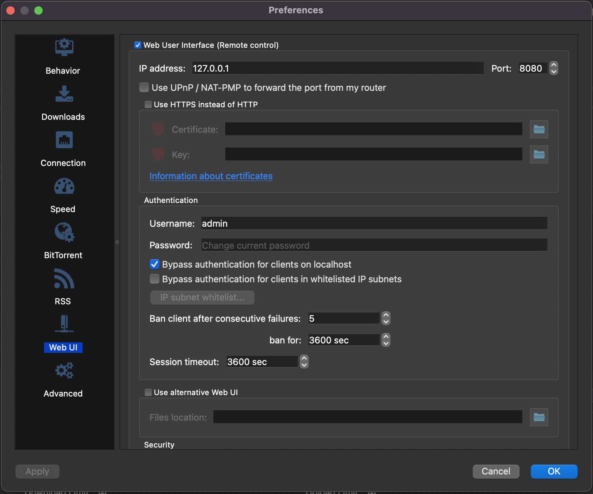

# AnimeFinder

ACG (Anime, Comics, Games) resource finder & downloader.

## Build Status

## System requirements

- Windows / macOS / android / Linux / iOS
- *(For build only)* [Flutter SDK](https://docs.flutter.dev/get-started/install), *(Android)* [Android Studio](https://developer.android.com/studio/install), *(iOS, macOS)*  [Xcode](https://apps.apple.com/us/app/xcode/id497799835?mt=12), *(Windows)* [Visual Studio](https://visualstudio.microsoft.com/downloads/)
- [qBittorrent v4.1+](https://www.qbittorrent.org/download.php) is required for torrent downloading

## Features

- Support Traditional Chinese and English UI
- Automatic layout depends on screen size and orientation
- Support searching (and downloading on some of the) below sites:
  - [DMHY](https://share.dmhy.org) (Anime, Anime Songs, Games, Comics, Japanese TV Shows)
  - [ACG.RIP](https://acg.rip) (Anime, Japanese TV Shows, Variety Shows, Music, Others)
  - [Bangumi Moe](https://bangumi.moe) (Anime)
  - [KissSub](https://kisssub.org) (Anime, Comics, Music, Others)
  - [Mikan](http://mikanani.me) (Anime)
  - [Nyaa](https://nyaa.si) (Anime, Music, Comics, Photos, Software, Games)

- Support Chinese content filtering 
- Support downloading (Requires [qBittorrent v4.1+](https://www.qbittorrent.org/download.php))
- *Local downloading feature does not support on mobile version yet*

## UI showcase

## qBittorrent Settings (Windows, macOS, linux)

No need to change qBittorrent API Endpoint if you use the above settings
